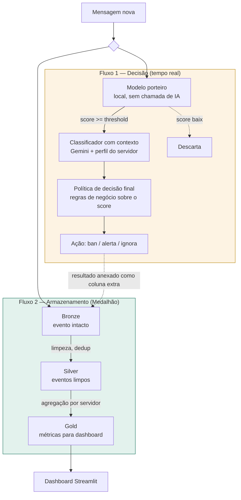

# Sentinel.AI — Pipeline de Moderação de Conteúdo em Tempo Real

Projeto da disciplina de Engenharia de Dados. Implementa um ciclo de vida de dados completo — ingestão, processamento, armazenamento e consumo — capaz de moderar mensagens de chat em tempo real com inteligência sensível ao contexto de cada comunidade, em vez de aplicar uma blacklist fixa de termos.

Este README documenta o **MVP efetivamente implementado e validado com dados reais** (incluindo chamadas reais à API do Gemini). A arquitetura de produção planejada na 1ª avaliação — com Kafka, Spark, MinIO, Airflow e Metabase — está detalhada em `docs/ARQUITETURA_VI.md`, com rastreabilidade explícita de como cada peça deste MVP corresponde a uma peça daquela arquitetura.

---

## 1. Relatório de mudanças em relação à 1ª avaliação

Este MVP foi construído corrigindo as lacunas comentadas na 1 apresentação diretamente:

| Lacuna apontada | Correção aplicada neste MVP |
|---|---|
| Arquitetura simplificada, sem monitoramento/qualidade/governança, sem todos os fluxos | Seção 3 detalha os dois fluxos completos com payload explícito; Seção 6 implementa as 4 camadas transversais como módulos de código reais, não como menção em prosa |
| Tecnologias sem detalhamento de governança/monitoramento/qualidade/segurança | Seção 5 lista, para cada tecnologia, o motivo da escolha e o que ela implementa de cada domínio transversal |
| Relato simplificado, pontas soltas | Cada módulo de código tem seu papel explicitado; a tabela de correspondência (Seção 8) fecha qualquer ambiguidade sobre por que cada tecnologia foi substituída |

Adicionalmente, as ferramentas de infraestrutura pesada da 1ª avaliação (Kafka, Spark, MinIO, Airflow, Metabase) foram substituídas por equivalentes leves o suficiente para validação solo. essa substituição está detalhada e justificada na Seção 8, e a especificação completa para reverter essa substituição (implantar o stack real) está em `docs/IMPLEMENTACAO_EXECUTAVEL.md`.

---

## 2. Descrição do projeto

* **Contexto de negócio:** plataformas de comunicação em tempo real (Discord, Twitch, chats de jogos) que precisam de moderação escalável e sensível ao contexto de cada comunidade.
* **Problema:** moderação manual é lenta e inescalável; moderação automática tradicional (blacklist fixa) ignora contexto — a mesma expressão pode ser ofensiva em um grupo e corriqueira em outro.
* **Stakeholders:** equipes de Trust & Safety, moderadores de comunidade, usuários finais.

---

## 3. Os dois fluxos — a regra arquitetural central do projeto

O sistema tem **dois fluxos paralelos com propósitos diferentes**, que se cruzam em um único ponto. Esta distinção é a base de todo o restante do projeto.

* **Fluxo 1 — Decisão.** Responde "esta mensagem, agora, neste grupo, é tóxica?". Roda em tempo real, mensagem por mensagem, e termina ao gerar uma ação.
* **Fluxo 2 — Armazenamento (Arquitetura Medalhão).** Responde "o que aconteceu até agora?". Acumula histórico, alimenta auditoria e dashboard. Não decide nada — apenas registra e agrega decisões que o Fluxo 1 já tomou.

O ponto de cruzamento: o resultado do Fluxo 1 (score, categoria, ação) é anexado como colunas extras ao registro da mensagem **antes** desse registro entrar na camada Bronze.



**Prova de independência dos fluxos:** se o Fluxo 2 fosse desligado, a moderação continuaria funcionando — perderia-se apenas histórico e dashboard. O inverso não é verdade.

---

## 4. Fluxo 1 em detalhe — a cascata de decisão

O Fluxo 1 não usa um classificador único. É uma cascata de três estágios, motivada por uma restrição de capacidade real: não é viável, em nenhum orçamento, chamar uma IA generativa para 100% do tráfego de um chat de alto volume (5.000–10.000 msg/s, conforme volume de referência da 1ª avaliação).

**Estágio 1 — Modelo porteiro** (`src/decision/porteiro.py`)
Local, sem chamada de rede, calcula um score de suspeita (0.0–1.0) combinando um vocabulário base com o vocabulário específico do servidor (vindo da fonte de contexto, Seção 5). Mensagens abaixo do threshold (padrão 0.3, configurável via `.env`) são descartadas sem nunca acionar a IA — essa filtragem é o que torna o volume de tráfego viável.

**Estágio 2 — Classificador com contexto** (`src/decision/classificador.py`)
Só roda para o que passou do porteiro. Chama a API do Gemini (`gemini-2.5-flash`), enviando o texto da mensagem **junto com o perfil de contexto completo do servidor** — nunca o histórico de mensagens cru, apenas o perfil já resumido. Devolve `{score, categoria, acao_sugerida}`.

**Estágio 3 — Política de decisão final** (`src/decision/acao.py`)
Lógica de negócio local, determinística e auditável — não confia ciegamente na sugestão do LLM:
```
score >= 0.85  → ban
score >= 0.50  → alerta
score <  0.50  → ignora
```
Essa separação entre "o que o LLM sugere" e "o que o sistema decide" existe para que a decisão final seja auditável e não dependa inteiramente de uma caixa-preta de terceiros.

O orquestrador de todo o Fluxo 1 está em `src/decision/engine.py`, que busca mensagens pendentes no Bronze e executa a cascata completa para cada uma.

**Tratamento de falha:** a API do Gemini tem rate limit de 5 requisições/minuto no tier gratuito. O classificador implementa espera automática (13s entre chamadas) e, em caso de erro (rate limit ou indisponibilidade), cai em um fallback seguro (`ignora` / `erro_classificacao`) em vez de travar o pipeline — validado em teste real, incluindo um caso de `503 Service Unavailable` tratado corretamente.

---

## 5. A fonte de contexto — de onde vem o conhecimento da IA

Esta é a peça que diferencia o projeto de um filtro de palavrões comum. Sem ela, o sistema seria um classificador genérico, incapaz de diferenciar comunidades.

### 5.1. Estrutura do perfil (`ai_server_context`)

```json
{
  "server_id": "sv_jogos",
  "em_modo_treino": false,
  "mensagens_observadas": 13,
  "toxicity_level": 0.6,
  "vocab_map": {
    "vai se ferrar": 1.0,
    "alguém aí?": 0.2,
    "opa, tudo bem?": 0.0
  },
  "conflict_patterns": ["..."],
  "metadata": {"tom_geral": "..."}
}
```

Este é um exemplo real, extraído durante o desenvolvimento, do perfil gerado pelo Gemini para um dos servidores de teste — não um exemplo ilustrativo hipotético.

### 5.2. Ciclo de vida do perfil (`src/decision/perfil_servidor.py`)

1. **Servidor novo ou com poucas mensagens (< `TREINO_THRESHOLD`, padrão 50):** entra em **modo treino**. O sistema observa e grava normalmente no Fluxo 2, mas o Fluxo 1 não tem perfil específico para consultar ainda.
2. **Threshold atingido:** dispara um **scan inicial** — uma amostra de até 100 mensagens recentes do servidor é enviada a uma LLM grande (Gemini) com uma instrução explícita: a LLM **não classifica mensagem por mensagem aqui** — ela resume o comportamento do grupo como um todo.
3. **Perfil gravado**, `em_modo_treino` passa a `false`. A partir daqui, o Fluxo 1 consulta este perfil para cada mensagem nova daquele servidor.
4. **Atualização periódica:** um job reprocessa uma amostra recente e atualiza o perfil — capturado por `atualizar_todos_os_servidores()`.
5. **Feedback humano** (`feedback_humano`): quando um moderador confirma ou reverte uma ação, isso é registrado e deve alimentar a próxima atualização do perfil.

### _possibilidade de banco de dados vetorial*_

O perfil é **estatístico** (agregados como `toxicity_level`, `vocab_map`), não uma coleção de mensagens para busca por similaridade semântica. Uma consulta relacional simples por `server_id` é suficiente — banco vetorial (pgvector, Pinecone, Chroma) adicionaria complexidade sem resolver um problema real desta arquitetura. Essa decisão está registrada como avaliada e descartada conscientemente, não como lacuna não considerada, ver Seção 9 (Próximos Passos) para a única condição em que isso mudaria.

---

## 6. Domínio transversal — Qualidade, Governança, Monitoramento, Segurança

Estas quatro camadas não são uma etapa que o dado passa por *depois* do pipeline. são propriedades aplicadas em pontos específicos do fluxo, com código real e testável, não apenas menção em texto.

### 6.1. Qualidade

| Onde se aplica | Mecanismo | Arquivo |
|---|---|---|
| Entrada (antes de gravar no Bronze) | `validar_mensagem()` rejeita texto vazio, `user_id`/`server_id` ausente, e texto acima de 2000 caracteres — rejeitado na entrada, não corrigido silenciosamente depois | `src/ingestion/simulator.py` |
| Bronze → Silver | Deduplicação por `message_id`, rejeição de campo nulo crítico, normalização de texto | `src/pipeline/silver.py` |

### 6.2. Governança

| Aspecto | Política | Mecanismo |
|---|---|---|
| Retenção do Bronze | 30 dias (configurável via `RETENCAO_BRONZE_DIAS`) | `src/pipeline/retencao.py` |
| Retenção da Silver | 60 dias (configurável via `RETENCAO_SILVER_DIAS`) | `src/pipeline/retencao.py` |
| Rastreabilidade de decisão automatizada | Eventos com ação tomada (`ban`/`alerta`) **nunca são apagados** pela política de retenção, mesmo após expirar — preserva auditoria de toda decisão automatizada | `aplicar_retencao_bronze()` / `aplicar_retencao_silver()` |
| Direito de reversão | Moderador humano pode registrar reversão de uma decisão automatizada | Tabela `feedback_humano` |
| Controle de acesso a dado pessoal (política documentada) | `user_id` e `texto` da mensagem são dado pessoal — acesso deveria ser restrito à equipe de Trust & Safety; o dashboard atual já não expõe `user_id` em nenhuma aba, apenas métricas agregadas (Gold) ou mensagens sem identificação direta | Princípio de minimização de dados aplicado ao desenho do dashboard (`src/dashboard/app.py`) |

### 6.3. Monitoramento

| Camada | O que é registrado | Mecanismo |
|---|---|---|
| Log granular por serviço | Toda decisão, rejeição e erro, com timestamp e nível (INFO/WARNING/ERROR) | `src/shared/logger.py`, grava em `logs/pipeline.log` |
| Métricas de execução de jobs | Duração, registros processados, status (sucesso/erro) de cada execução de Silver, Gold, Fluxo 1, atualização de perfil e retenção | Tabela `pipeline_execucoes`, populada por `src/shared/monitoring.py` (context manager `monitorar_job`) |
| Visibilidade no dashboard | Aba "Saúde do pipeline": métricas de execução + últimas 100 linhas do log granular | Aba `aba_logs` em `src/dashboard/app.py` |

**Decisão de design:** log granular fica em arquivo (evita acoplamento de falha: se o Postgres cair, o log ainda registra isso); métricas agregadas de execução ficam no Postgres (dado de negócio sobre saúde do pipeline, não log evento-a-evento). As duas são visíveis na mesma aba do dashboard.

### 6.4. Segurança

| Aspecto | Mecanismo | Arquivo |
|---|---|---|
| Segredos (chave de API, credenciais de banco) | Nunca em texto plano no código; `.env` com `.gitignore` garantindo que nunca é commitado | `.env` / `.gitignore` |
| Mascaramento de dado pessoal | `mascarar_user_id()` aplica hash determinístico com salt (SHA-256). mesmo usuário sempre gera o mesmo identificador mascarado, sem o valor original ser reversível a partir do hash | `src/shared/security.py` |
| Controle de acesso (política documentada, não implementada via usuários de banco separados neste MVP) | Cada serviço de produção deveria ter usuário de banco com privilégio mínimo (detalhado em `docs/ARQUITETURA_VI.md`, Seção 7.4) — decisão consciente de manter um único usuário no MVP por simplicidade de demonstração solo | — |

---

## 7. Orquestração e Dashboard

### 7.1. Orquestração (`src/orchestration/scheduler.py`)

APScheduler agenda os jobs do pipeline em intervalos escalonados, refletindo a dependência real entre eles (cada etapa precisa de dado pronto da anterior):

| Job | Intervalo | Por quê |
|---|---|---|
| Ingestão (simulação) | 2 min | Gera tráfego de teste |
| Fluxo 1 (decisão) | 3 min | Consome o que a ingestão gerou |
| Silver | 5 min | Consome o que o Fluxo 1 decidiu |
| Gold | 7 min | Consome o que a Silver limpou |
| Atualização de perfil de servidor | 15 min | Não precisa de alta frequência. é conhecimento de contexto, não decisão imediata |

### 7.2. Dashboard (`src/dashboard/app.py`)

Streamlit como tela principal, com 4 abas:

* **Simular mensagem** — dispara o ciclo completo manualmente (ingestão → Fluxo 1 → Silver → Gold), mostra as últimas mensagens processadas.
* **Dashboard** — métricas agregadas por servidor (Gold): total de mensagens, ações tomadas, toxicidade média, gráficos de barra.
* **Perfis de servidor** — expõe o `ai_server_context` de cada servidor, indicando se está em modo treino ou com perfil ativo, e o vocabulário mapeado.
* **Saúde do pipeline** — métricas de execução de jobs (`pipeline_execucoes`) e log granular (últimas 100 linhas de `logs/pipeline.log`).

---

## 8. Tabela de correspondência: Final/Produção → MVP

| Papel arquitetural | Arquitetura visionária | MVP implementado | Justificativa |
|---|---|---|---|
| Ingestão | Apache Kafka | `src/ingestion/simulator.py` (gera + valida mensagens) | Kafka exige cluster; volume do protótipo não justifica |
| Cache de contexto | Redis | Tabela `ai_server_context` consultada direto no Postgres | Sem necessidade de latência sub-ms em ambiente de validação |
| Processamento | PySpark / Spark Streaming | Python + Pandas (`src/pipeline/silver.py`, `gold.py`) | Processamento distribuído não traz benefício no volume de protótipo single-node |
| Armazenamento / Data Lake | PostgreSQL + MinIO | PostgreSQL apenas (tabelas Bronze/Silver/Gold) | Um único serviço gerenciado em vez de dois |
| Orquestração | Apache Airflow | APScheduler (`src/orchestration/scheduler.py`) | Airflow exige scheduler, webserver e metastore próprios |
| Ação | FastAPI | `src/decision/acao.py` (função Python com log estruturado) | Sem chat real conectado neste MVP |
| Consumo | Metabase | Streamlit (`src/dashboard/app.py`) | Sem configuração de servidor adicional, mesmo repositório |
| Ambiente | Docker (múltiplos serviços) | Docker (apenas PostgreSQL) | Reduz de 7+ containers inter-dependentes para 1 |

**O que não mudou entre as duas versões:** a lógica de negócio completa — os dois fluxos, a cascata de 3 estágios, a fonte de contexto, as 4 camadas transversais. A especificação completa para reverter esta substituição e implantar o stack real está em `docs/IMPLEMENTACAO_EXECUTAVEL.md`, com rastreabilidade explícita confirmando que nenhuma regra de decisão muda na transição — apenas o motor de execução.

---

## 9. Estrutura do repositório

```
sentinel-ai/
├── README.md
├── .env / .env.example
├── .gitignore
├── docker-compose.yml
├── requirements.txt
├── sql/
│   └── schema.sql
├── logs/
│   └── pipeline.log
├── docs/
│   ├── ARQUITETURA_VI.md
│   └── IMPLEMENTACAO_EXECUTAVEL.md
└── src/
    ├── db.py
    ├── shared/
    │   ├── logger.py
    │   ├── monitoring.py
    │   └── security.py
    ├── ingestion/
    │   └── simulator.py
    ├── decision/
    │   ├── porteiro.py
    │   ├── classificador.py
    │   ├── acao.py
    │   ├── engine.py
    │   └── perfil_servidor.py
    ├── pipeline/
    │   ├── silver.py
    │   ├── gold.py
    │   └── retencao.py
    ├── orchestration/
    │   └── scheduler.py
    └── dashboard/
        └── app.py
```

---

## 10. Como executar

```bash
# 1. Subir o PostgreSQL
docker compose up -d

# 2. Ativar ambiente virtual e instalar dependências
python3 -m venv venv
source venv/bin/activate
pip install -r requirements.txt

# 3. Configurar variáveis de ambiente
cp .env.example .env
# editar .env com a chave do Gemini

# 4. Gerar tráfego de teste
python -m src.ingestion.simulator

# 5. Rodar o Fluxo 1 (decisão)
python -m src.decision.engine

# 6. Rodar o Fluxo 2 (Medalhão)
python -m src.pipeline.silver
python -m src.pipeline.gold

# 7. Construir o perfil de contexto dos servidores
python -m src.decision.perfil_servidor

# 8. (Opcional) Aplicar política de retenção
python -m src.pipeline.retencao

# 9. Rodar tudo automaticamente
python -m src.orchestration.scheduler

# 10. Abrir o dashboard
streamlit run src/dashboard/app.py
```

---

## 11. Riscos, limitações e próximos passos

* **Riscos:** rate limit do tier gratuito do Gemini (5 req/min) — tratado com espera automática e fallback seguro, mas representa um limite real de throughput em qualquer demonstração ao vivo com volume maior.
* **Limitações:** dados simulados, sem conexão a um chat real, para não expor dados de usuários reais. Processamento sequencial (Pandas) não reflete o throughput exigido em produção (5.000–10.000 msg/s) — ver a conta de capacidade detalhada em `docs/ARQUITETURA_VI.md`, Seção 6.
* **Próximos passos:**
  * Avaliação comparativa de modelos para o classificador de contexto.
  * Teste de carga para identificar em que volume a migração para Spark/Kafka se torna necessária.
  * Implementação completa do loop de feedback humano influenciando a atualização do perfil de servidor (a tabela `feedback_humano` existe; falta o job que lê dela e ajusta o `ai_server_context`).
  * Avaliação de banco de dados vetorial (ex.: pgvector) **apenas se** o perfil de servidor evoluir de estatísticas agregadas para um banco de exemplos reais de mensagens — cenário em que busca por similaridade semântica passaria a ser necessária. Decisão atual (Seção 5.3): não introduzir essa complexidade sem esse requisito concreto.
  * Implementação de usuários de banco com privilégio mínimo por serviço (já especificado em `docs/IMPLEMENTACAO_EXECUTAVEL.md`, Seção 5).

---

## 12. Referências

* KREPS, Jay. *Questioning the Lambda Architecture*. O'Reilly, 2014.
* Databricks. *What is the Medallion Lakehouse Architecture?* Documentação oficial.
* Documentação oficial: PostgreSQL, APScheduler, Streamlit, Google Gemini API.

-- 
* foi utilizado IA para a formatação e clareza deste texto, correção ortográfica e insights durante o projeto