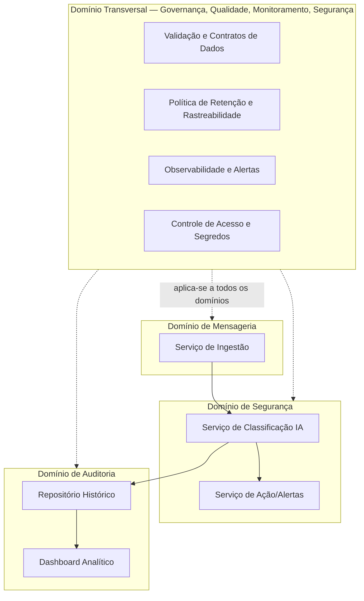
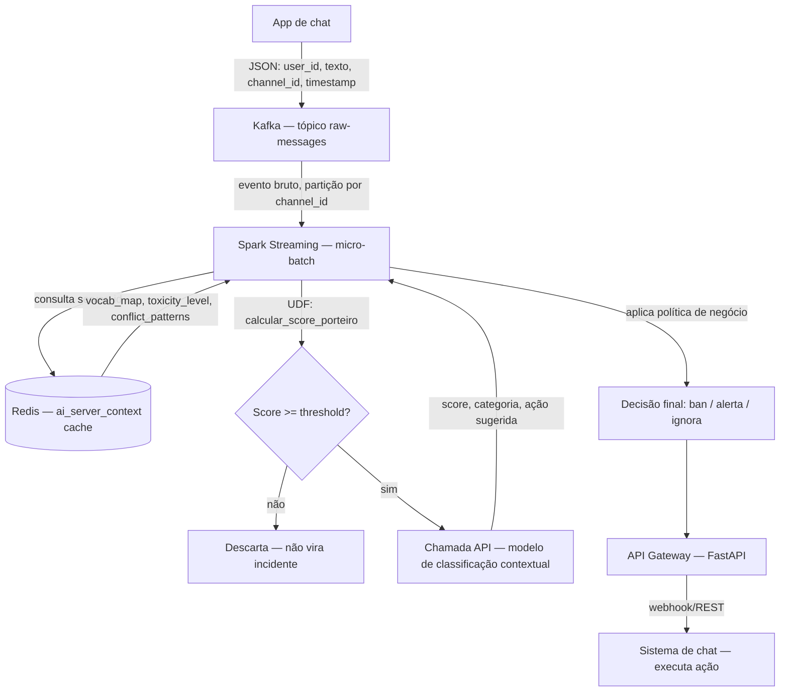
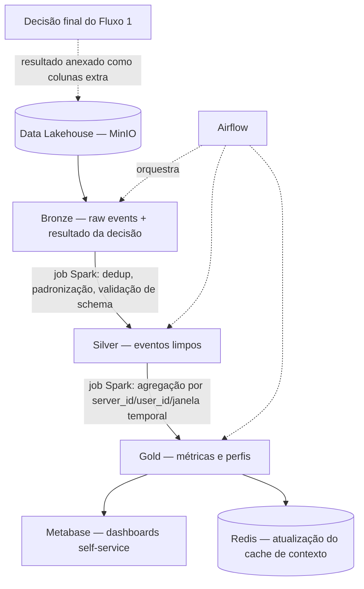

# Sentinel.AI — Especificação da Arquitetura Visionária

> Documento de especificação técnica para implantação completa da arquitetura de produção planejada na 1ª avaliação. Este documento é complementar ao `README.md` (que descreve o MVP efetivamente implementado) e segue um formato spec-driven: cada componente tem requisitos explícitos, critérios de aceite, e passos de implantação reproduzíveis.
>
> O MVP implementado (ver `README.md`) já validou a **lógica de negócio** desta especificação — os dois fluxos (decisão e armazenamento), a fonte de contexto da IA, e a cascata porteiro→classificador. O que esta especificação adiciona é a **camada de infraestrutura de produção** necessária para operar em escala (5.000–10.000 mensagens/segundo), além das camadas de Governança, Qualidade, Monitoramento e Segurança que a avaliação da 1ª entrega apontou como insuficientes.

---

## 1. Sumário das correções incorporadas ao feedback recebido

A 1ª entrega obteve 6,5/10,0, com perdas concentradas em quatro pontos. Esta especificação corrige cada um explicitamente:

| Lacuna apontada | Nota anterior | Correção aplicada nesta especificação |
|---|---|---|
| Arquitetura e fluxo de dados muito simplificados, sem tecnologia/monitoramento/qualidade/governança, sem todos os fluxos | 0,5/2,0 | Seção 4 detalha os dois fluxos (decisão e Medalhão) com payload explícito em cada etapa; Seção 7 adiciona os quatro domínios transversais (Qualidade, Governança, Monitoramento, Segurança) como componentes de primeira classe, não como nota de rodapé |
| Tecnologias sem detalhamento nem cobertura de governança/monitoramento/qualidade/segurança | 1,0/2,0 | Seção 5 lista, para cada etapa do ciclo de vida, a tecnologia, a justificativa, os requisitos de versão, e a tecnologia específica de cada domínio transversal |
| Relato simplificado, pontas soltas | 1,0/2,0 | Cada componente desta especificação tem requisito de entrada, requisito de saída, e critério de aceite — não há componente sem contrato de dados definido |

---

## 2. Ambiente de implantação — requisitos de máquina

Esta especificação assume implantação em **uma única máquina de desenvolvimento/demonstração**, não em servidores dedicados. Isso é uma decisão consciente de escopo: a arquitetura visionária é desenhada para produção distribuída, mas sua implantação de referência aqui documentada roda em Docker Compose sobre WSL2, permitindo que o mesmo conjunto de manifestos seja posteriormente portado para um cluster real (Kubernetes, ECS, ou VMs dedicadas) sem reescrita do core.

### 2.1. Requisitos de sistema operacional

| Item | Requisito mínimo |
|---|---|
| Sistema operacional host | Windows 10 versão 2004+ (build 19041+) ou Windows 11 |
| Subsistema Linux | WSL2 (não WSL1 — Spark e Kafka exigem chamadas de sistema Linux completas) |
| Distribuição WSL | Ubuntu 22.04 LTS ou superior |
| Virtualização | VT-x/AMD-V habilitada na BIOS (requisito do WSL2 e do Docker Desktop) |
| RAM disponível para o WSL | Mínimo 16 GB recomendados — Kafka + Zookeeper + Spark + MinIO + Airflow + Postgres + Metabase, somados, consomem entre 8 e 12 GB em idle |
| Espaço em disco | Mínimo 30 GB livres (imagens Docker + volumes de dados + logs) |
| Docker | Docker Desktop para Windows, com integração WSL2 habilitada (Settings → Resources → WSL Integration) |
| Docker Compose | v2.20+ (incluído no Docker Desktop atual) |

### 2.2. Verificação de pré-requisitos

```bash
# Dentro do WSL2 (Ubuntu)
wsl --version          # confirma WSL2, rodar no PowerShell do Windows
docker --version        # >= 24.0
docker compose version  # >= 2.20
free -h                  # confirma RAM disponível dentro do WSL
df -h                     # confirma espaço em disco
```

**Critério de aceite desta seção:** os quatro comandos acima retornam sem erro, e a RAM livre reportada por `free -h` é igual ou superior a 16 GB.

---

## 3. Domínios e serviços

A arquitetura mantém os três domínios definidos na 1ª avaliação, com a adição explícita de um quarto domínio transversal que a avaliação apontou como ausente.



**Por que um domínio transversal, e não um quarto domínio em série:** Governança, Qualidade, Monitoramento e Segurança não são uma etapa que o dado passa por *depois* das outras — são propriedades que cada serviço dos outros três domínios precisa ter desde o primeiro dia. Tratar isso como domínio em série (como se fosse "primeiro Mensageria, depois Segurança, depois Auditoria, depois Qualidade") foi exatamente a simplificação que a 1ª entrega cometeu implicitamente, ao não mencionar essas camadas em nenhum lugar do fluxo.

---

## 4. Os dois fluxos — especificação completa com payload

A arquitetura tem dois fluxos paralelos com propósitos diferentes, validados no MVP e aqui especificados para a versão de produção. **Fluxo 1 decide e morre; Fluxo 2 acumula e nunca decide.**

### 4.1. Fluxo 1 — Decisão (tempo real, core do sistema)



**Contrato de dados de cada etapa:**

| Etapa | Entrada | Saída | SLA de latência |
|---|---|---|---|
| Kafka (ingestão) | JSON do app de chat | Evento particionado no tópico `raw-messages` | < 50ms (produção no tópico) |
| Spark Streaming (consumo) | Lote de eventos do tópico | DataFrame em memória, micro-batch | < 200ms por micro-batch |
| Consulta Redis | `server_id` | `{toxicity_level, vocab_map, conflict_patterns}` | < 10ms (cache em memória) |
| Modelo porteiro (UDF) | texto + vocab_map | score float 0.0–1.0 | < 5ms (sem chamada de rede) |
| Classificador (API externa) | texto + contexto completo do servidor | `{score, categoria, acao_sugerida}` em JSON | < 300ms (chamada de API) |
| Decisão final | score + ação sugerida + regras de negócio | `{acao: ban\|alerta\|ignora}` | < 1ms (lógica local) |
| API Gateway | decisão final + message_id | Confirmação de execução da ação | < 100ms |
| **Total ponta a ponta** | | | **< 500ms** (SLA definido na 1ª avaliação) |

### 4.2. Fluxo 2 — Armazenamento (Arquitetura Medalhão)



**Contrato de dados de cada camada:**

| Camada | Granularidade | Formato de armazenamento | Retenção (ver Seção 7.2 — Governança) |
|---|---|---|---|
| Bronze | 1 linha por mensagem, dado intacto | Parquet particionado por `dt` (data) e `server_id` | 90 dias (auditoria mínima) |
| Silver | 1 linha por mensagem, limpa e validada contra schema | Parquet particionado por `dt` | 180 dias |
| Gold | Agregada por servidor/usuário/janela temporal | Parquet ou tabela Delta, otimizada para consulta analítica | Indefinida (dado agregado, baixo custo de armazenamento) |

---

## 5. Tecnologias por etapa do ciclo de vida — requisitos e justificativa

### 5.1. Ingestão — Apache Kafka

**Papel arquitetural:** transporte confiável e ordenado de eventos de alta vazão, com retenção temporária que permite replay (fundamento da Arquitetura Kappa adotada).

| Requisito | Especificação |
|---|---|
| Versão | Kafka 3.7+ (requer Zookeeper 3.8+ ou modo KRaft sem Zookeeper, recomendado a partir do Kafka 3.x) |
| Modo recomendado | KRaft (elimina a dependência do Zookeeper, reduz um serviço inteiro do Docker Compose) |
| Partições do tópico `raw-messages` | Mínimo 6 partições, para permitir paralelismo de até 6 consumers simultâneos no Spark |
| Retenção do tópico | 7 dias (`retention.ms=604800000`) — permite reprocessamento via Kappa sem custo de armazenamento permanente no próprio Kafka |
| Replicação | 1 em ambiente de demonstração single-node; 3 em produção multi-broker |
| Imagem Docker recomendada | `confluentinc/cp-kafka:7.6.0` ou `bitnami/kafka:3.7` (ambas com suporte a KRaft) |

**Critério de aceite:** `kafka-topics.sh --bootstrap-server localhost:9092 --list` retorna o tópico `raw-messages`; uma mensagem de teste produzida é consumida com latência abaixo de 100ms.

### 5.2. Processamento — Apache Spark (Structured Streaming)

**Papel arquitetural:** consumo do stream Kafka, execução do modelo porteiro como UDF, orquestração da chamada ao classificador, e gravação no Lakehouse.

| Requisito | Especificação |
|---|---|
| Versão | Spark 3.5+ (suporte nativo a Structured Streaming com Kafka connector estável) |
| Modo de execução | Standalone cluster (1 master + N workers) em Docker Compose; em produção real, YARN ou Kubernetes |
| Conector Kafka | `spark-sql-kafka-0-10_2.12` na mesma major version do Spark instalado |
| Memória por worker | Mínimo 2 GB para o volume de demonstração; escalar conforme throughput real |
| Linguagem de UDF | Python via PySpark (consistência com o restante do stack, que é Python) |
| Imagem Docker recomendada | `apache/spark:3.5.1-python3` ou `bitnami/spark:3.5` |

**Critério de aceite:** um job de streaming consome do tópico `raw-messages`, aplica a UDF do porteiro, e grava no MinIO sem erro por pelo menos 10 minutos contínuos sob carga de teste.

### 5.3. Cache de contexto — Redis

**Papel arquitetural:** servir o `ai_server_context` (perfil de contexto do servidor) com latência de milissegundos, evitando consulta ao banco relacional a cada mensagem.

| Requisito | Especificação |
|---|---|
| Versão | Redis 7.2+ |
| Modo de persistência | RDB snapshot a cada 5 minutos (perfil de contexto não é crítico o suficiente para exigir AOF) |
| Estrutura de dados | Hash por `server_id`, com campos `toxicity_level`, `vocab_map` (serializado JSON), `conflict_patterns` (serializado JSON) |
| TTL | Sem expiração automática — o perfil é atualizado por job do Airflow, não por expiração de cache |
| Imagem Docker recomendada | `redis:7.2-alpine` |

**Critério de aceite:** `redis-cli GET server_profile:sv_jogos` retorna o JSON do perfil em menos de 10ms.

### 5.4. Modelo de classificação — API de LLM externa

**Papel arquitetural:** decidir, com sensibilidade ao contexto do servidor, se uma mensagem que passou pelo porteiro é tóxica.

| Requisito | Especificação |
|---|---|
| Provedor validado no MVP | Google Gemini (`gemini-2.5-flash`) |
| Limite de cota observado (tier gratuito) | 5 requisições/minuto — **insuficiente para produção**, exige tier pago ou provedor com SLA de produção antes de qualquer carga real |
| Requisito de produção | Contrato com SLA de disponibilidade e cota mínima de N requisições/segundo compatível com o volume esperado (5.000–10.000 msg/s seria inviável via chamada síncrona a qualquer LLM hoje — ver Seção 6 sobre a necessidade de filtragem agressiva no porteiro) |
| Tratamento de falha | Circuit breaker: após N falhas consecutivas, degradar para decisão apenas via porteiro, com alerta automático (ver Seção 7.3 — Monitoramento) |

**Nota de honestidade técnica:** o volume de 5.000–10.000 mensagens/segundo declarado na 1ª avaliação é incompatível com classificação síncrona via LLM em 100% do tráfego, mesmo em produção com tier pago. A arquitetura depende estruturalmente do modelo porteiro filtrar a vasta maioria do tráfego antes de qualquer chamada de IA — isso já está refletido no desenho do Fluxo 1, mas precisa ser dito explicitamente como premissa de capacidade.

### 5.5. Armazenamento — PostgreSQL + MinIO

**Papel arquitetural:** PostgreSQL para dados relacionais de baixa latência (perfis, feedback humano, metadados); MinIO como Data Lake compatível com S3 para as camadas Bronze/Silver/Gold em volume.

| Requisito | Especificação |
|---|---|
| Versão PostgreSQL | 16+ (mesma versão validada no MVP) |
| Extensões recomendadas | `pgcrypto` (para mascaramento de dados sensíveis — ver Seção 7.4, Segurança) |
| Versão MinIO | RELEASE.2024-01+ (qualquer build recente com suporte a Object Lock) |
| Política de bucket | Buckets separados por camada: `bronze-events`, `silver-events`, `gold-metrics`, com versionamento habilitado no bucket Bronze (auditoria) |
| Formato de arquivo no Lakehouse | Parquet com compressão Snappy (padrão de mercado para Spark + analytics) |
| Imagens Docker recomendadas | `postgres:16` / `minio/minio:latest` |

### 5.6. Orquestração — Apache Airflow

**Papel arquitetural:** agendamento e encadeamento dos jobs de limpeza (Bronze→Silver), agregação (Silver→Gold), atualização do perfil de contexto, e retreinamento futuro de modelos.

| Requisito | Especificação |
|---|---|
| Versão | Airflow 2.9+ |
| Executor | `LocalExecutor` para o ambiente de demonstração single-node; `CeleryExecutor` ou `KubernetesExecutor` em produção distribuída |
| Banco de metadados do Airflow | PostgreSQL dedicado (pode ser uma base separada na mesma instância Postgres do projeto, nunca a mesma base dos dados de negócio) |
| DAGs mínimas requeridas | `dag_bronze_to_silver` (a cada 5 min), `dag_silver_to_gold` (a cada 15 min), `dag_atualizar_perfil_servidor` (a cada 1h ou sob demanda quando `mensagens_observadas` cruza o `TREINO_THRESHOLD`) |
| Imagem Docker recomendada | `apache/airflow:2.9.1-python3.11` |

**Critério de aceite:** a interface web do Airflow (`localhost:8080`) lista as 3 DAGs com status de execução, e cada uma tem pelo menos uma execução bem-sucedida registrada no histórico.

### 5.7. Ação / interface com o chat — FastAPI

**Papel arquitetural:** receber a decisão final do Fluxo 1 e traduzi-la em uma chamada real à API do sistema de chat (Discord, por exemplo) para executar ban, timeout, ou alerta a um moderador.

| Requisito | Especificação |
|---|---|
| Versão Python | 3.12+ |
| Framework | FastAPI 0.110+ com Uvicorn como servidor ASGI |
| Autenticação de saída | Token de bot da plataforma de chat (ex.: Discord Bot Token), armazenado conforme Seção 7.4 (Segurança) — nunca em texto plano no código |
| Idempotência | Toda chamada de ação deve ser idempotente por `message_id`, evitando ban duplicado se o Fluxo 1 reprocessar o mesmo evento |

### 5.8. Consumo — Metabase

**Papel arquitetural:** dashboard self-service para a equipe de Trust & Safety, lendo diretamente das tabelas Gold.

| Requisito | Especificação |
|---|---|
| Versão | Metabase 0.49+ |
| Banco de metadados do Metabase | PostgreSQL dedicado (mesma regra do Airflow: nunca compartilhar base com os dados de negócio) |
| Fonte de dados conectada | Leitura direta das tabelas Gold no Postgres, ou via conector Parquet/Athena se o Gold estiver em MinIO |
| Controle de acesso | Grupos de permissão do próprio Metabase, alinhados à política de Governança (Seção 7.2) — moderadores veem métricas agregadas, não mensagens individuais com dado pessoal |
| Imagem Docker recomendada | `metabase/metabase:v0.49.x` |

---

## 6. Premissa de capacidade — por que o porteiro é estrutural, não opcional

Esta seção existe porque a 1ª avaliação declarou um volume (5.000–10.000 msg/s) sem explicitar como a arquitetura sustenta isso. Fazendo as contas:

- Uma chamada típica a uma API de LLM externa custa entre 150ms e 800ms de latência.
- Mesmo com paralelismo alto (1.000 chamadas simultâneas), isso sustenta uma taxa muito inferior a 5.000 msg/s se **toda** mensagem fosse classificada por IA.
- **Conclusão:** o modelo porteiro local (sem chamada de rede, < 5ms) precisa filtrar pelo menos 90–95% do tráfego para que o volume declarado seja sustentável. Isso não é uma otimização — é um requisito de capacidade que define se a arquitetura é viável ou não no volume declarado.

Essa conta deve ser apresentada explicitamente na defesa do projeto como evidência de que a arquitetura foi pensada com rigor de capacidade, não apenas de fluxo lógico.

---

## 7. Domínio transversal — Qualidade, Governança, Monitoramento, Segurança

Esta seção responde diretamente aos dois critérios da avaliação que perderam mais nota. Cada subseção segue o mesmo formato: o que é, onde se aplica no fluxo, e qual tecnologia/mecanismo implementa.

### 7.1. Qualidade

**Definição operacional:** garantir que nenhum dado mal formado, duplicado, ou fora de contrato avance no pipeline sem ser detectado e tratado explicitamente.

| Ponto de aplicação | Mecanismo | Tecnologia |
|---|---|---|
| Entrada (antes do Kafka aceitar) | Validação de schema do JSON recebido — campos obrigatórios, tipos, tamanho máximo de texto | JSON Schema validado na camada de API Gateway de ingestão, antes de produzir no tópico |
| Bronze → Silver | Deduplicação por `message_id`, rejeição de campo nulo crítico, normalização de texto | Job PySpark com `dropDuplicates()` e validação de schema via `StructType` explícito |
| Contrato entre serviços | Schema Registry — qualquer mudança de formato no JSON da mensagem precisa ser compatível com versões anteriores (backward compatibility) | Confluent Schema Registry, integrado ao Kafka via Avro ou JSON Schema |
| Validado no MVP | Validação na ingestão (`validar_mensagem`, rejeitando texto vazio/nulo antes de gravar) | Replicar o mesmo princípio, mas como validação de schema formal via Schema Registry em produção |

**Critério de aceite:** uma mensagem malformada (campo obrigatório ausente) é rejeitada no ponto de entrada com log de rejeição, e nunca aparece em nenhuma camada do Medalhão.

### 7.2. Governança

**Definição operacional:** quem pode acessar o quê, por quanto tempo o dado é retido, e como decisões automatizadas podem ser auditadas e revertidas.

| Aspecto | Política definida | Mecanismo |
|---|---|---|
| Retenção do Bronze | 90 dias (auditoria mínima exigível) | Lifecycle policy no bucket MinIO `bronze-events`, exclusão automática após expiração |
| Retenção do Silver | 180 dias | Lifecycle policy equivalente no bucket `silver-events` |
| Retenção do Gold | Indefinida (dado agregado, sem PII direta) | Sem política de expiração |
| Rastreabilidade de decisão automatizada | Toda ação (ban/alerta) deve ser reconstituível: qual mensagem, qual score, qual versão do perfil de contexto foi usada na decisão | Campo de versionamento no `ai_server_context` (mantido como histórico, não sobrescrito) + tabela `feedback_humano` já validada no MVP |
| Direito de reversão | Moderador humano pode reverter uma decisão automatizada | Tabela `feedback_humano`, alimentando o próximo ciclo de retreinamento do perfil — mecanismo já implementado no MVP |
| Controle de acesso a dado pessoal | `user_id` e `texto` da mensagem são dados pessoais (LGPD) — acesso restrito à equipe de Trust & Safety, nunca exposto em dashboard agregado | Grupos de permissão no Metabase (Seção 5.8) + mascaramento de `user_id` em qualquer view de consumo amplo |

### 7.3. Monitoramento

**Definição operacional:** visibilidade contínua sobre a saúde de cada componente do pipeline, com alertas antes que uma falha silenciosa cause dano (ex.: classificador fora do ar sem que ninguém perceba).

| Camada | O que é monitorado | Tecnologia |
|---|---|---|
| Logs granulares por serviço | Cada serviço (Kafka, Spark, Airflow, API Gateway) emite logs estruturados (JSON) com nível, timestamp, e identificador de correlação (`message_id` quando aplicável) | Padrão de log estruturado validado no MVP (Python `logging` com formato consistente); em produção, agregado via ELK Stack (Elasticsearch + Logstash + Kibana) ou Grafana Loki |
| Métricas de execução de jobs | Duração, registros processados, taxa de erro de cada execução de job do Airflow | Tabela de métricas equivalente à `pipeline_execucoes` validada no MVP, ou nativamente via interface do Airflow em produção |
| Alertas de degradação | Circuit breaker do classificador (Seção 5.4) disparando alerta quando a taxa de erro da API de IA excede um limiar | Prometheus + Alertmanager, ou alerta nativo da plataforma de observabilidade escolhida |
| Métricas de negócio | Volume de mensagens por servidor, taxa de ações tomadas, tempo médio de decisão | Dashboard Gold no Metabase (Seção 5.8) |

**Critério de aceite:** uma falha simulada na API do classificador (ex.: derrubar a chave de API) gera um alerta visível em menos de 5 minutos, sem que o pipeline trave silenciosamente.

### 7.4. Segurança

**Definição operacional:** proteção de credenciais, dados sensíveis, e superfícies de acesso ao sistema.

| Aspecto | Política | Mecanismo |
|---|---|---|
| Segredos (chaves de API, senhas de banco) | Nunca em texto plano no código ou em variável de ambiente exposta em log | Vault (HashiCorp Vault) ou Docker Secrets em produção; `.env` com `.gitignore` no MVP (já validado) como prática mínima de desenvolvimento |
| Dados sensíveis em repouso | `user_id` e `texto` da mensagem mascarados ou criptografados quando armazenados além do período de auditoria ativa | Extensão `pgcrypto` do PostgreSQL para colunas sensíveis; criptografia server-side do MinIO (SSE-S3) nos buckets |
| Comunicação entre serviços | TLS em todas as conexões entre serviços (Kafka, Postgres, Redis, APIs) | Certificados TLS internos, gerenciados via cert-manager se o ambiente migrar para Kubernetes |
| Controle de acesso à infraestrutura | Princípio do menor privilégio — cada serviço tem usuário de banco próprio, com permissão limitada às tabelas que efetivamente usa | Usuários PostgreSQL distintos por serviço (ex.: usuário do Airflow não tem permissão de escrita na tabela `feedback_humano`) |
| Auditoria de acesso | Quem acessou qual dado, quando | Log de acesso do PostgreSQL (`pgaudit`) habilitado nas tabelas que contêm dado pessoal |

**Critério de aceite:** uma tentativa de acesso ao banco com credencial de um serviço diferente do esperado (ex.: usuário do Metabase tentando escrever na tabela Bronze) é rejeitada pelo controle de permissão do PostgreSQL.

---

## 8. Passos de implantação (spec-driven)

Cada passo lista pré-condição, ação, e critério de aceite — nenhum passo deve iniciar sem que o critério de aceite do anterior tenha sido confirmado.

### Passo 1 — Ambiente base
- **Pré-condição:** Windows com WSL2 e Docker Desktop instalados (Seção 2).
- **Ação:** validar os 4 comandos da Seção 2.2.
- **Critério de aceite:** todos retornam sem erro; RAM livre ≥ 16 GB.

### Passo 2 — Rede e orquestração de containers
- **Pré-condição:** Passo 1 concluído.
- **Ação:** criar um único `docker-compose.yml` com todos os serviços (Kafka em modo KRaft, Spark master+worker, Redis, PostgreSQL — com bases separadas para negócio/Airflow/Metabase —, MinIO, Airflow, FastAPI, Metabase), todos na mesma rede Docker dedicada (`sentinel-network`).
- **Critério de aceite:** `docker compose up -d` sobe todos os serviços sem erro de dependência circular; `docker compose ps` mostra todos com status `healthy` ou `running`.

### Passo 3 — Mensageria
- **Pré-condição:** Passo 2 concluído, Kafka `healthy`.
- **Ação:** criar o tópico `raw-messages` com as especificações da Seção 5.1.
- **Critério de aceite:** conforme Seção 5.1.

### Passo 4 — Armazenamento
- **Pré-condição:** Passo 2 concluído, PostgreSQL e MinIO `healthy`.
- **Ação:** aplicar o schema relacional (extensão do `schema.sql` validado no MVP, adicionando os campos de versionamento de perfil descritos na Seção 7.2); criar os buckets MinIO com as políticas de lifecycle da Seção 7.2.
- **Critério de aceite:** as tabelas existem no Postgres (`\dt` retorna a lista esperada); os buckets existem no MinIO com lifecycle policy ativa (`mc ilm ls <bucket>` retorna a regra configurada).

### Passo 5 — Processamento (Fluxo 1)
- **Pré-condição:** Passos 3 e 4 concluídos.
- **Ação:** portar a lógica já validada no MVP (`porteiro.py`, `classificador.py`, `acao.py`) para jobs PySpark Structured Streaming, substituindo a leitura do Postgres por leitura do tópico Kafka, e a consulta de contexto do Postgres por consulta ao Redis.
- **Critério de aceite:** conforme Seção 5.2; latência ponta a ponta do Fluxo 1 medida abaixo de 500ms para mensagens que não passam pelo porteiro, e abaixo de 1s para mensagens que acionam o classificador.

### Passo 6 — Processamento (Fluxo 2 / Medalhão)
- **Pré-condição:** Passo 5 concluído (Bronze recebendo dados reais do Fluxo 1).
- **Ação:** portar `silver.py` e `gold.py` do MVP para jobs PySpark equivalentes, lendo/escrevendo Parquet no MinIO em vez de tabelas Postgres.
- **Critério de aceite:** uma execução completa do job Silver e do job Gold processa pelo menos 1.000 eventos de teste sem erro, com os arquivos Parquet visíveis no MinIO Console.

### Passo 7 — Orquestração
- **Pré-condição:** Passos 5 e 6 concluídos.
- **Ação:** criar as 3 DAGs do Airflow (Seção 5.6), portando a lógica de agendamento já validada no MVP via APScheduler.
- **Critério de aceite:** conforme Seção 5.6.

### Passo 8 — Ação e consumo
- **Pré-condição:** Passo 5 concluído (decisões sendo geradas).
- **Ação:** implementar o serviço FastAPI (Seção 5.7) e conectar o Metabase às tabelas/arquivos Gold (Seção 5.8).
- **Critério de aceite:** uma ação de teste (ban simulado) é recebida pelo FastAPI e logada como executada; o Metabase exibe ao menos um dashboard com dados reais do Gold.

### Passo 9 — Domínio transversal
- **Pré-condição:** Passos 1–8 concluídos (sistema funcionalmente completo).
- **Ação:** aplicar os mecanismos das 4 subseções da Seção 7 — Schema Registry, lifecycle policies, stack de observabilidade, Vault/Secrets, TLS entre serviços.
- **Critério de aceite:** os critérios de aceite individuais de 7.1, 7.2, 7.3 e 7.4.

### Passo 10 — Teste de carga
- **Pré-condição:** Passo 9 concluído.
- **Ação:** simular carga crescente (iniciando em 100 msg/s, dobrando até identificar o ponto de saturação) usando uma ferramenta de geração de carga (ex.: k6, Locust, ou um produtor Kafka customizado).
- **Critério de aceite:** o sistema sustenta pelo menos 1.000 msg/s sem degradação de latência acima do SLA definido (Seção 4.1); o ponto exato de saturação é documentado como achado do teste, não assumido a priori.

---

## 9. Rastreabilidade entre o MVP validado e esta especificação

Esta tabela existe para a defesa do projeto: cada peça da arquitetura visionária tem uma contraparte já testada com dados reais no MVP, o que demonstra que a lógica de negócio não é apenas teórica.

| Componente visionário | Equivalente validado no MVP | O que muda na transição |
|---|---|---|
| Kafka (tópico `raw-messages`) | Fila Python em memória (`src/ingestion/simulator.py`) | Troca de transporte; contrato de dados (campos do JSON) idêntico |
| Spark Streaming + UDF do porteiro | `src/decision/porteiro.py`, rodando via Pandas | Mesma função de cálculo de score; troca do motor de execução |
| Redis (cache de contexto) | Tabela `ai_server_context` no Postgres | Mesma estrutura de dados (vocab_map, toxicity_level); troca de motor de consulta |
| Classificador via API de LLM | `src/decision/classificador.py`, já usando Gemini real | Nenhuma mudança de lógica — mesma chamada de API, mesmo contrato de prompt |
| MinIO (Bronze/Silver/Gold em Parquet) | Tabelas `bronze_eventos`, `silver_eventos`, `gold_dashboard_metrics` no Postgres | Mesmo contrato de colunas; troca de formato de arquivo e motor de armazenamento |
| Airflow (DAGs) | `src/orchestration/scheduler.py` via APScheduler | Mesmos jobs, mesma cadência relativa; troca de motor de agendamento |
| FastAPI (ação) | `src/decision/acao.py`, função Python direta | Mesma política de decisão (`decidir_acao_final`); adição de camada de API real |
| Metabase | Streamlit (`src/dashboard/app.py`) | Mesmas métricas (Gold), mesma fonte de dados; troca de ferramenta de visualização |
| Schema Registry / validação de qualidade | `validar_mensagem()` em `src/ingestion/simulator.py` | Mesmo princípio (rejeitar na entrada); formalização via schema versionado |
| Tabela `pipeline_execucoes` + log estruturado | Já implementado integralmente no MVP | Sem mudança de lógica; adição de agregação centralizada (ELK/Grafana) |

**Conclusão da rastreabilidade:** nenhuma peça desta especificação visionária introduz uma lógica de negócio nova em relação ao que já roda no MVP. A diferença entre os dois documentos é exclusivamente de infraestrutura — motor de execução, motor de armazenamento, motor de orquestração — nunca de regra de decisão. Isso é evidência direta de que a arquitetura é coerente de ponta a ponta, do protótipo à visão de produção.

